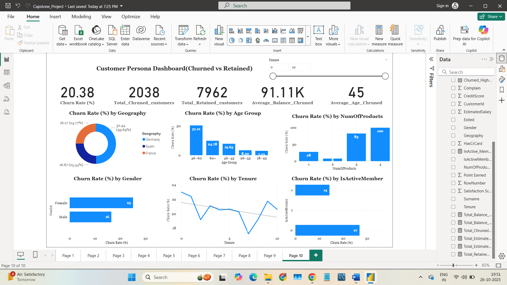
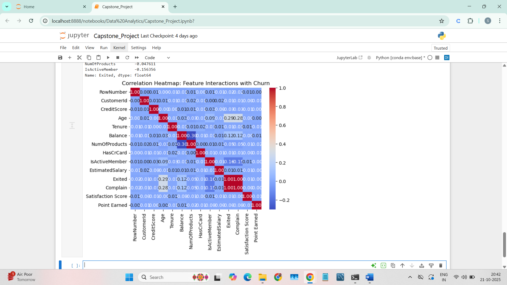
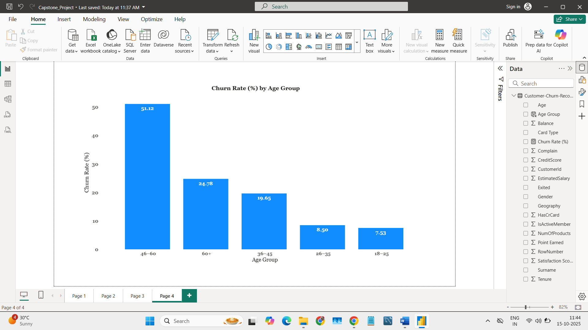

# 📊 Customer Churn Analysis — End-to-End Data Analytics Project  
### Python • SQL • Power BI • Excel • Data Cleaning • EDA • Dashboarding

---

## 🚀 Project Overview
This project is a complete **end-to-end Customer Churn Analysis** workflow using **Python, SQL, Power BI, and Excel**.  
It demonstrates the full data analytics lifecycle:

- Data extraction  
- Data cleaning  
- EDA (Exploratory Data Analysis)  
- SQL insights  
- Excel dashboarding  
- Power BI interactive reporting  
- Business insights & recommendations  

The goal is to understand **why customers churn** and identify patterns to help reduce churn.

---

## 🛠️ Tools & Technologies Used

| Category | Tools |
|---------|-------|
| Programming | Python (Pandas, NumPy, Matplotlib) |
| Database | SQL |
| BI Tools | Power BI |
| Reporting | Excel (Power Query, PivotTables) |
| Version Control | Git, GitHub |

---


---

## 🔧 End-to-End Workflow

### **1️⃣ Data Collection & Understanding**
- Loaded raw dataset  
- Checked missing values, duplicates, and data types  
- Identified key customer attributes related to churn  

---

### **2️⃣ Data Cleaning (Python + Excel)**
- Removed duplicates  
- Treated missing data  
- Standardized categorical values  
- Created derived fields (AgeGroup, BalanceCategory, etc.)  
- Exported cleaned dataset  

---

### **3️⃣ Exploratory Data Analysis (Python)**
Key visualizations include:
- Churn distribution  
- Credit score analysis  
- Age group vs churn  
- Gender-based churn  
- Geographic churn  
- Product usage  
- Correlation heatmap  

---

### **4️⃣ SQL Insights**
Queries include:
- Churn rate by geography  
- High-balance churn  
- Credit card vs no credit card  
- Avg balance/salary for churned vs retained  
- Product count vs churn  

---

### **5️⃣ Excel Dashboard**
Used:
- PivotTables  
- PivotCharts  
- Slicers  
- Interactive views for churn metrics  

---

### **6️⃣ Power BI Dashboard**
Built an interactive BI dashboard with:
- Churn KPIs  
- Geography segmentation  
- Age-based trends  
- Credit score patterns  
- Customer persona analysis  
- Retention insights  

---

## 📊 Key Insights

### 🔹 Customers with **low credit scores** churn more  
### 🔹 **Germany** has the highest churn  
### 🔹 Ages **45–60** have the highest churn rate  
### 🔹 Customers with **1 product** churn more  
### 🔹 Inactive customers are more likely to churn  
### 🔹 Customers **without credit cards** churn more  

These insights help businesses design better retention strategies.

---

## 📸 Project Screenshots

### **Power BI Dashboard**


### **Correlation Heatmap (Python)**


### **Churn Distribution**


### **Age Group vs Churn**


---

## 💡 Business Recommendations
- Improve engagement for **non-active customers**  
- Launch retention programs for **high-churn geographies**  
- Target customers aged **45–60** with customized offers  
- Cross-sell additional products (reduce churn for 1-product users)  
- Promote credit score education programs  

---

## 📥 How to Run the Project

### **Python**
```bash
pip install pandas numpy matplotlib
jupyter notebook python/customer_churn_project.ipynb

### **SQL**
Run sql/Churn_queries.sql in MySQL/PostgreSQL/SQL Server.

### **Power BI**
powerbi/customer_churn_dashboard.pbix

### **Excel**
excel/customer_churn_dashboard.xlsx


